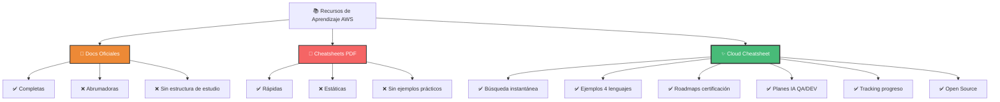
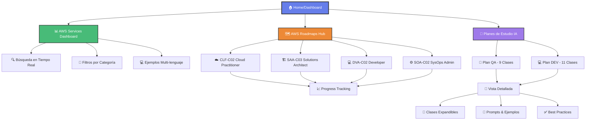
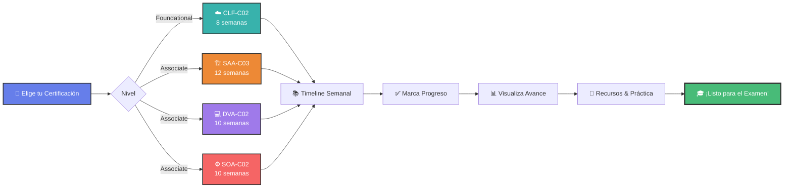
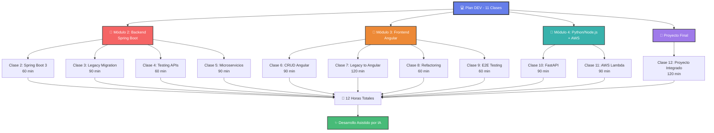
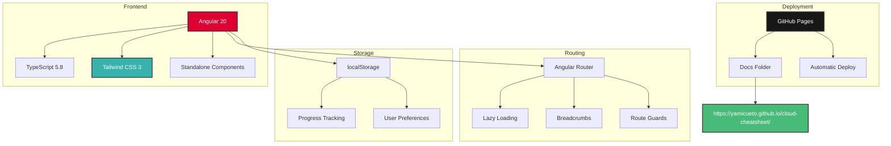
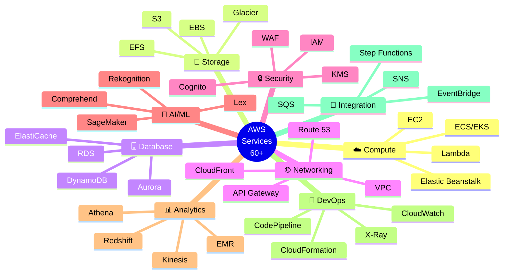

# AWS Cloud Cheatsheet 🚀☁️

<div align="center">


**Tu compañero visual e interactivo para dominar AWS | Perfect for AWS Certification Prep**

[Demo en Vivo](https://yamicueto.github.io/cloud-cheatsheet/) | [Reportar Bug](https://github.com/YamiCueto/cloud-cheatsheet/issues) | [Solicitar Feature](https://github.com/YamiCueto/cloud-cheatsheet/issues)

</div>

---

## 🎯 ¿Por qué otro AWS Cheatsheet?

La documentación oficial de AWS es **completa pero abrumadora**. Los cheatsheets estáticos son **útiles pero aburridos**. 

Este proyecto nace de una necesidad real: **aprender AWS de forma visual, interactiva y práctica** mientras te preparas para certificaciones.

### 🌟 Lo que hace diferente a Cloud Cheatsheet:



| Característica | Docs Oficiales | Cheatsheets PDF | Cloud Cheatsheet ✨ |
|---------------|----------------|-----------------|---------------------|
| Búsqueda instantánea | ✅ | ❌ | ✅ |
| Ejemplos de código | ✅ | ⚠️ | ✅ (4 lenguajes) |
| Interfaz visual | ⚠️ | ❌ | ✅ |
| Filtros por categoría | ⚠️ | ❌ | ✅ |
| Roadmaps de certificación | ❌ | ❌ | ✅ (CLF, SAA, DVA, SOA) |
| Plan de estudio IA | ❌ | ❌ | ✅ |
| Tracking de progreso | ❌ | ❌ | ✅ (localStorage) |
| Actualizado constantemente | ✅ | ❌ | ✅ |
| Gratis y Open Source | ✅ | ⚠️ | ✅ |

---

## 🏗️ Arquitectura de la Aplicación



## ✨ Características Principales

### 📊 Dashboard Interactivo
- **60+ servicios AWS** organizados por categorías
- **Búsqueda en tiempo real** - Encuentra servicios al instante
- **Filtros inteligentes** - Compute, Storage, Database, Networking, Security, ML, Analytics, DevOps
- **Cards visuales** con iconos oficiales de AWS

### 🗺️ Roadmaps de Certificación AWS
Planes de estudio estructurados con tracking de progreso:



**Certificaciones disponibles:**
- **CLF-C02** - AWS Cloud Practitioner (8 semanas)
- **SAA-C03** - Solutions Architect Associate (12 semanas)
- **DVA-C02** - Developer Associate (10 semanas)
- **SOA-C02** - SysOps Administrator Associate (10 semanas)

**Cada roadmap incluye:**
- ✅ Timeline semanal con temas específicos
- ✅ Progreso persistente (localStorage)
- ✅ Recursos gratuitos y de pago recomendados
- ✅ Información detallada del examen

### 🤖 Planes de Estudio: IA Generativa para Equipos Técnicos
Cursos completos de **Prompt Engineering** y desarrollo con IA para diferentes roles:

#### 🧪 Plan para QA (Quality Assurance)
- 📚 **9 clases estructuradas** con talleres prácticos
- 🎯 Generación de test cases, datos de prueba y automatización
- 💡 De tester manual a **QA con superpoderes de IA**
- ⚡ Incrementa productividad x3-5 en testing

#### 💻 Plan para Developers (Full Stack)



**Características del plan:**
- 📚 **11 clases intensivas** (12 horas totales)
- 🏗️ **4 módulos**: Backend (Spring Boot), Frontend (Angular), Python/Node.js + AWS, Proyecto Final
- 🛠️ Stack: Java, Angular, Python, FastAPI, Node.js, Lambda, DynamoDB
- 🎯 De código manual a **desarrollo asistido por IA**
- 📱 **Diseño responsive** con navegación expandible y breadcrumbs
- ✨ Cards legibles con mejor UX y contraste optimizado

**Características de los planes:**
- ✅ Interfaz moderna con sidebar púrpura y navegación breadcrumb
- ✅ Cards expandibles para preview rápido
- ✅ Páginas detalladas con contenido completo de cada clase
- ✅ Ejemplos de prompts profesionales vs casuales
- ✅ Mejores prácticas DO's y DON'Ts
- ✅ Herramientas y recursos recomendados

### 💻 Ejemplos de Código Multi-lenguaje
Para cada servicio AWS:
- **AWS CLI** - Comandos directos
- **Node.js** - SDK de JavaScript/TypeScript
- **Python** - Boto3
- **Java** - SDK oficial

### 🎨 Diseño Moderno y Responsivo
- **Tailwind CSS 3** - Diseño profesional
- **Dark Mode Ready** - Interfaz amigable
- **Mobile First** - Funciona en cualquier dispositivo

### 🛠️ Stack Tecnológico



---

## 🚀 Inicio Rápido

### Prerrequisitos
- Node.js 18+ 
- npm o yarn
- Angular CLI 20+

### Instalación

```bash
# Clonar el repositorio
git clone https://github.com/YamiCueto/cloud-cheatsheet.git

# Navegar al directorio
cd cloud-cheatsheet

# Instalar dependencias
npm install

# Iniciar servidor de desarrollo
npm start
```

Abre tu navegador en `http://localhost:4200/`

### Build para Producción

```bash
# Build optimizado
npm run build

# Los archivos se generan en /docs para GitHub Pages
```

---

## 📚 Servicios AWS Incluidos

### 🗂️ Organización por Categorías



### ☁️ Compute
- **EC2** - Elastic Compute Cloud (Virtual Servers)
- **Lambda** - Serverless Functions
- **ECS** - Elastic Container Service
- **EKS** - Elastic Kubernetes Service
- **Elastic Beanstalk** - PaaS for Web Apps
- **Lightsail** - Simple Virtual Servers

### 💾 Storage
- **S3** - Simple Storage Service (Object Storage)
- **EBS** - Elastic Block Store (Block Storage)
- **EFS** - Elastic File System (NFS)
- **Glacier** - Archive Storage
- **Storage Gateway** - Hybrid Cloud Storage
- **FSx** - Managed File Systems

### 🗄️ Database
- **RDS** - Relational Database Service
- **DynamoDB** - NoSQL Database
- **Aurora** - MySQL/PostgreSQL Compatible
- **ElastiCache** - In-Memory Cache (Redis/Memcached)
- **DocumentDB** - MongoDB Compatible
- **Neptune** - Graph Database

### 🌐 Networking & Content Delivery
- **VPC** - Virtual Private Cloud
- **CloudFront** - CDN (Content Delivery Network)
- **Route 53** - DNS Service
- **API Gateway** - API Management
- **Direct Connect** - Dedicated Network Connection
- **Global Accelerator** - Network Performance

### 🔒 Security, Identity & Compliance
- **IAM** - Identity and Access Management
- **KMS** - Key Management Service
- **Cognito** - User Authentication
- **Secrets Manager** - Credentials Storage
- **GuardDuty** - Threat Detection
- **WAF** - Web Application Firewall

### 🤖 Machine Learning & AI
- **SageMaker** - ML Platform
- **Rekognition** - Image/Video Analysis
- **Comprehend** - NLP Service
- **Lex** - Conversational AI
- **Polly** - Text-to-Speech
- **Transcribe** - Speech-to-Text

### 📊 Analytics
- **Athena** - SQL Queries on S3
- **Redshift** - Data Warehouse
- **Kinesis** - Real-time Data Streaming
- **EMR** - Big Data Processing (Hadoop/Spark)
- **QuickSight** - BI and Visualization
- **Glue** - ETL Service

### 🔧 Developer Tools & DevOps
- **CloudFormation** - Infrastructure as Code
- **CodePipeline** - CI/CD Service
- **CodeBuild** - Build Service
- **CodeDeploy** - Deployment Automation
- **CloudWatch** - Monitoring and Logging
- **X-Ray** - Distributed Tracing
- **Systems Manager** - Operations Management

### 🔔 Application Integration
- **SQS** - Message Queue
- **SNS** - Pub/Sub Messaging
- **EventBridge** - Event Bus
- **Step Functions** - Workflow Orchestration
- **AppSync** - GraphQL API

---

## 📖 Cómo Usar para Certificaciones AWS

### 1️⃣ Selecciona tu Certificación
Navega a **AWS Roadmaps** y elige:
- **CLF-C02** para comenzar (recomendado para principiantes)
- **SAA-C03** para arquitectura (más popular)
- **DVA-C02** para desarrollo
- **SOA-C02** para operaciones

### 2️⃣ Sigue el Timeline Semanal
Cada roadmap tiene un plan estructurado:
- Semana 1-2: Fundamentos
- Semana 3-4: Servicios principales
- Semana 5-6: Seguridad y networking
- Semana 7-8: Práctica intensiva

### 3️⃣ Marca tu Progreso
- ✅ Click en cada semana al completarla
- Tu progreso se guarda automáticamente
- Visualiza tu avance con la barra de progreso

### 4️⃣ Explora los Servicios
- Usa el **Dashboard** para entender cada servicio
- Revisa **ejemplos de código** en tu lenguaje favorito
- Lee **best practices** y casos de uso

### 5️⃣ Practica con Recursos Recomendados
Cada roadmap incluye links a:
- ✅ AWS Skill Builder (gratis)
- ✅ Whitepapers oficiales
- ✅ Practice exams (Tutorials Dojo)
- ✅ Cursos Udemy recomendados

---

## 🗺️ Roadmap del Proyecto

### ✅ Completado (v1.0)
- [x] Dashboard con 60+ servicios AWS
- [x] Búsqueda y filtros
- [x] Ejemplos de código multi-lenguaje
- [x] 4 Roadmaps de certificación (CLF, SAA, DVA, SOA)
- [x] Plan de estudio IA Generativa para QA (9 clases)
- [x] Plan de estudio completo para Developers (11 clases, 4 módulos)
- [x] Sistema de tracking de progreso
- [x] Diseño responsivo con Tailwind
- [x] Sidebar con gradiente púrpura
- [x] Navegación breadcrumbs jerárquica
- [x] Cards expandibles con preview
- [x] Mejoras de legibilidad y contraste

### 🚧 En Desarrollo (v1.1)
- [ ] Modo oscuro (Dark Mode)
- [ ] Comparador de servicios lado a lado
- [ ] Quiz mode para certificaciones
- [ ] Flashcards de servicios
- [ ] Traducción completa español/inglés
- [ ] Más roadmaps (Professional, Specialty)

### 🔮 Futuro (v2.0)
- [ ] Backend con Firebase/Supabase
- [ ] Autenticación de usuarios
- [ ] Sincronización de progreso en la nube
- [ ] Comunidad y foro de preguntas
- [ ] Sistema de badges y logros
- [ ] Generador de diagramas de arquitectura
- [ ] Calculadora de costos AWS
- [ ] Integración con AWS Free Tier tracking

---

## 🤝 Contribuir

¡Las contribuciones son bienvenidas! Este es un proyecto de la comunidad para la comunidad.

### Cómo Contribuir

1. **Fork** el repositorio
2. **Crea** una rama para tu feature (`git checkout -b feature/AmazingFeature`)
3. **Commit** tus cambios (`git commit -m 'Add some AmazingFeature'`)
4. **Push** a la rama (`git push origin feature/AmazingFeature`)
5. **Abre** un Pull Request

### Ideas para Contribuir
- 📝 Agregar más servicios AWS
- 🌍 Mejorar traducciones ES/EN
- 🎨 Mejorar diseño UI/UX
- 🐛 Reportar y corregir bugs
- 📚 Agregar más ejemplos de código
- 🗺️ Crear roadmaps para certificaciones Specialty
- ✨ Implementar features del roadmap

---

## 🌍 Comunidad y Soporte

### Para la Comunidad Hispana 🇪🇸🇲🇽🇨🇴🇦🇷
Este proyecto está diseñado especialmente para **desarrolladores de habla hispana** que están aprendiendo AWS. Aunque incluye contenido en inglés (términos técnicos), el enfoque educativo y los roadmaps están en español.

### Soporte
- 💬 [Discussions](https://github.com/YamiCueto/cloud-cheatsheet/discussions) - Preguntas y respuestas
- 🐛 [Issues](https://github.com/YamiCueto/cloud-cheatsheet/issues) - Reportar bugs
- 🐦 Twitter: [@YamiCueto](https://twitter.com/YamiCueto) - Actualizaciones

---

## 📄 Licencia

Este proyecto está bajo la licencia **MIT**. Ver [LICENSE](LICENSE) para más detalles.

---

## 🙏 Agradecimientos

- **AWS** por su increíble plataforma y documentación
- **Angular Team** por el framework
- **Tailwind CSS** por el sistema de diseño
- **Comunidad Open Source** por el apoyo constante
- **Todos los contributors** que hacen este proyecto posible

---

## 🌟 ¿Te ha ayudado este proyecto?

Si Cloud Cheatsheet te ha sido útil:
- ⭐ Dale una estrella al repositorio
- 🔗 Compártelo con tus colegas
- 🐛 Reporta bugs para mejorarlo
- 🤝 Contribuye con código o contenido
- 💬 Únete a las discusiones

---

<div align="center">

**Construido con ❤️ por [Yamid Cueto](https://github.com/YamiCueto)**

**Perfect for AWS Certification Prep | Perfecto para preparar certificaciones AWS**

[⬆ Volver arriba](#aws-cloud-cheatsheet-️)

</div>
